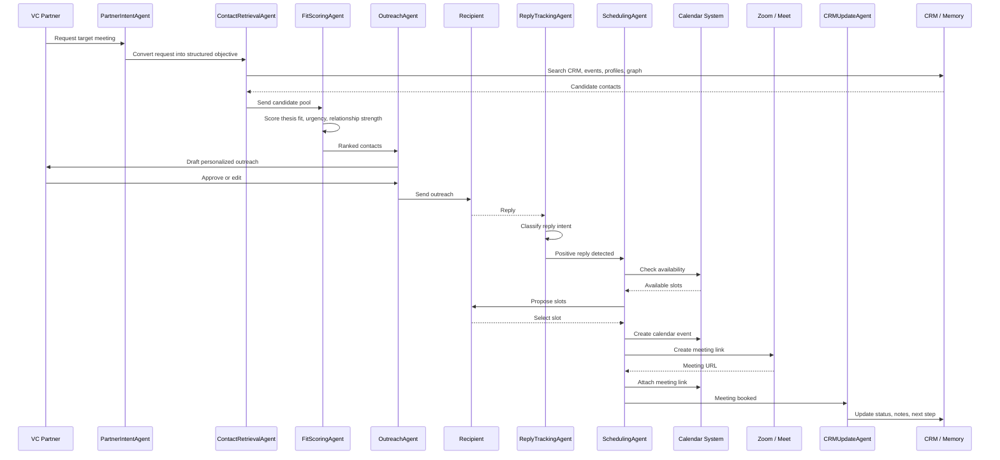
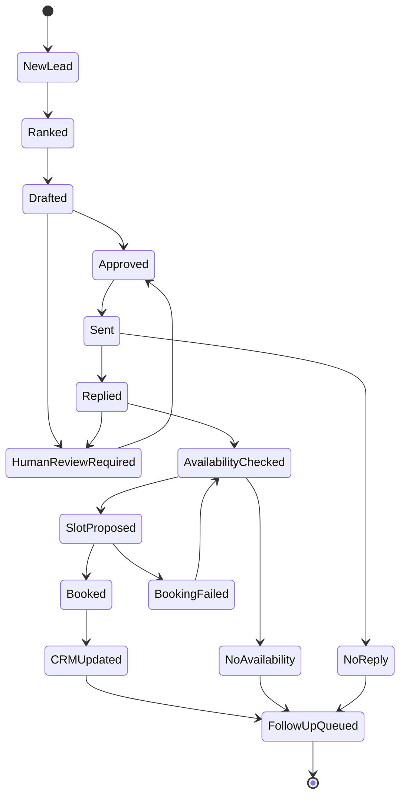
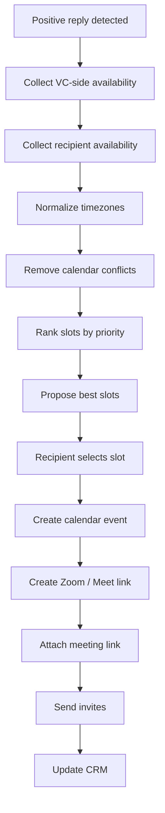
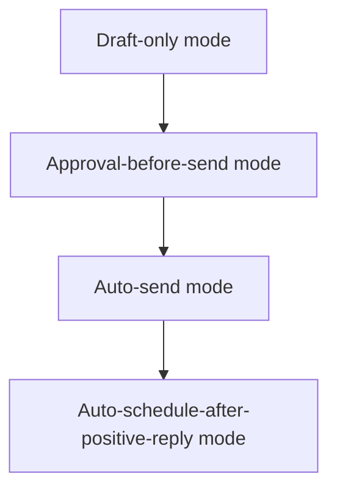
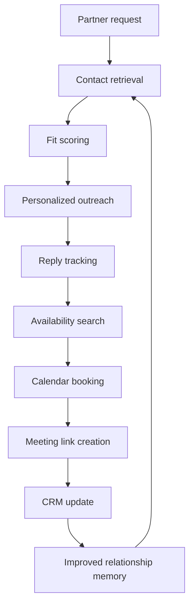

# LargeVCModel Architecture

## Architecture at a Glance

```mermaid
flowchart TD
    subgraph Product_Surface["Product Surface"]
        Dashboard["VC Dashboard"]
        ContactView["Contact / Founder Database"]
        OutreachConsole["Outreach Console"]
        BookingPanel["Calendar Booking Panel"]
        GraphView["Relationship Graph"]
        AdminView["Admin / Partner View"]
    end

    subgraph API_Layer["API Layer"]
        QueryAPI["/api/query"]
        SearchAPI["/api/contacts/search"]
        DraftAPI["/api/outreach/draft"]
        SendAPI["/api/outreach/send"]
        ReplyAPI["/api/replies/ingest"]
        AvailabilityAPI["/api/calendar/availability"]
        BookAPI["/api/calendar/book"]
        MeetingAPI["/api/meetings/create"]
        CRMAPI["/api/crm/update"]
    end

    subgraph Agent_Core["Large VC Agent Core"]
        IntentAgent["PartnerIntentAgent"]
        RetrievalAgent["ContactRetrievalAgent"]
        FitAgent["FitScoringAgent"]
        OutreachAgent["OutreachAgent"]
        ReplyAgent["ReplyTrackingAgent"]
        SchedulingAgent["SchedulingAgent"]
        LinkAgent["MeetingLinkAgent"]
        UpdateAgent["CRMUpdateAgent"]
        ApprovalGate["HumanApprovalGate"]
    end

    subgraph Data_Memory["Data + Memory"]
        CRM["Internal CRM"]
        EventDB["Event Attendee Database"]
        FounderProfiles["Founder Profiles"]
        RelationshipGraph["Relationship Graph"]
        OutreachHistory["Outreach History"]
        MeetingHistory["Meeting History"]
        CalendarCache["Calendar Availability Cache"]
        VectorIndex["Embedding Index"]
        AuditLog["Audit Log"]
    end

    subgraph Integrations["External Integrations"]
        Calendar["Google Calendar / Outlook"]
        ZoomMeet["Zoom / Google Meet"]
        Email["Gmail / Outlook"]
        CRMTools["Affinity / HubSpot / Airtable / Notion"]
        Slack["Slack"]
    end

    subgraph Observability["Observability"]
        Traces["Agent Traces"]
        OutreachLogs["Outreach Audit Logs"]
        SchedulingLogs["Scheduling State Logs"]
        ApprovalLogs["Human Approval Logs"]
        ErrorLogs["Error / Fallback Logs"]
    end

    Dashboard --> QueryAPI
    ContactView --> SearchAPI
    OutreachConsole --> DraftAPI
    OutreachConsole --> SendAPI
    BookingPanel --> AvailabilityAPI
    BookingPanel --> BookAPI
    GraphView --> QueryAPI
    AdminView --> ApprovalGate

    QueryAPI --> IntentAgent
    SearchAPI --> RetrievalAgent
    DraftAPI --> OutreachAgent
    SendAPI --> ApprovalGate
    ReplyAPI --> ReplyAgent
    AvailabilityAPI --> SchedulingAgent
    BookAPI --> SchedulingAgent
    MeetingAPI --> LinkAgent
    CRMAPI --> UpdateAgent

    IntentAgent --> RetrievalAgent
    RetrievalAgent --> FitAgent
    FitAgent --> OutreachAgent
    OutreachAgent --> ApprovalGate
    ApprovalGate --> ReplyAgent
    ReplyAgent --> SchedulingAgent
    SchedulingAgent --> LinkAgent
    LinkAgent --> UpdateAgent

    RetrievalAgent --> CRM
    RetrievalAgent --> EventDB
    RetrievalAgent --> FounderProfiles
    RetrievalAgent --> RelationshipGraph
    FitAgent --> VectorIndex
    OutreachAgent --> OutreachHistory
    SchedulingAgent --> CalendarCache
    UpdateAgent --> MeetingHistory
    UpdateAgent --> AuditLog

    SchedulingAgent --> Calendar
    LinkAgent --> ZoomMeet
    OutreachAgent --> Email
    UpdateAgent --> CRMTools
    UpdateAgent --> Slack

    IntentAgent --> Traces
    OutreachAgent --> OutreachLogs
    SchedulingAgent --> SchedulingLogs
    ApprovalGate --> ApprovalLogs
    ReplyAgent --> ErrorLogs
```

## End-to-End Scheduling Cycle

## Core Agent Responsibilities

| Agent                 | Responsibility                                                                                                  |
| --------------------- | --------------------------------------------------------------------------------------------------------------- |
| PartnerIntentAgent    | Converts partner requests into structured search, outreach, and scheduling objectives.                          |
| ContactRetrievalAgent | Searches CRM, event data, founder profiles, portfolio data, and relationship graph.                             |
| FitScoringAgent       | Scores contacts by thesis match, stage, sector, geography, urgency, founder quality, and relationship strength. |
| OutreachAgent         | Generates personalized outreach, follow-ups, intro notes, and meeting context.                                  |
| ReplyTrackingAgent    | Classifies replies as interested, not interested, wrong timing, needs follow-up, or human review.               |
| SchedulingAgent       | Checks availability, proposes time slots, resolves conflicts, and books meetings.                               |
| MeetingLinkAgent      | Creates Zoom or Google Meet links and attaches them to calendar events.                                         |
| CRMUpdateAgent        | Writes status, notes, meeting metadata, and follow-up actions back to CRM.                                      |
| HumanApprovalGate     | Controls when outreach, intros, and scheduling actions require VC approval.                                     |

## Data Model / Memory Layer

| Component             | Stores                                                                                 |
| --------------------- | -------------------------------------------------------------------------------------- |
| Contacts              | Founders, customers, investors, operators, advisors, and portfolio contacts.           |
| Relationship Edges    | Who knows whom, intro strength, last interaction, warm-path quality.                   |
| Outreach Events       | Sent messages, drafts, approvals, replies, follow-ups, and timestamps.                 |
| Meeting Records       | Booked calls, participants, agenda, meeting link, status, and outcome.                 |
| Calendar Availability | Cached availability windows, timezone data, conflicts, and slot rankings.              |
| Embeddings            | Semantic search index for contacts, notes, sectors, theses, and event data.            |
| Audit Logs            | Agent decisions, CRM writes, approval events, scheduling failures, and fallback paths. |

## Scheduling State Machine

## Calendar Booking Logic

## Human-in-the-Loop Control

## Final Architecture Loop

